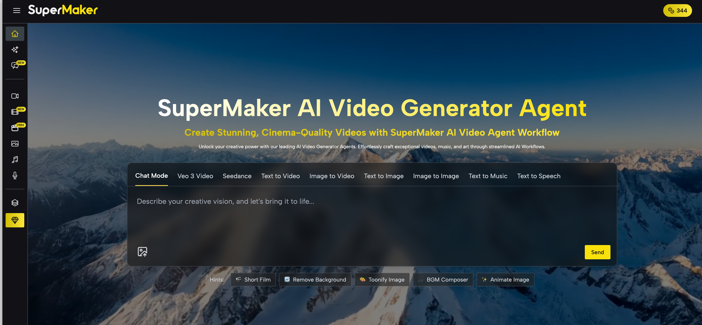

# SuperAI — 一站式 AI 多媒体创作平台

> 文本、图片、视频、音乐、音频的创作与互转；上手简单、品质可控。  
> 说明：本仓库用于产品介绍与使用指南，**不包含开源代码**。

[👉 立即体验](https://supermaker.ai)  ·  [📮 联系我们](mailto:support@supermaker.ai)

---

## 目录
- [产品简介](#产品简介)
- [核心功能](#核心功能)
- [界面预览](#界面预览)
- [模型与能力](#模型与能力)
- [典型场景与案例](#典型场景与案例)
- [开始使用](#开始使用)
- [竞品对比](#竞品对比)
- [技术说明（简版）](#技术说明简版)
- [路线图](#路线图)
- [FAQ](#faq)
- [声明](#声明)

---

## 产品简介
**SuperAI** 是面向创作者与团队的多模态 AI 创作平台，支持 **文本、图片、视频、音乐、音频** 五大媒介的创作与互转；提供资源追溯、二次创作与合成导出，适合短视频作者、品牌/营销、教育培训和设计团队快速生产高质量内容。

---

## 核心功能
- **五大媒介互转（已上线）**  
  Text / Image / Video / Audio / Music 可两两组合（如 文本→视频、图片→视频、文本→音乐…）。
- **二次创作与合成（已上线）**  
  对已生成内容进行参数调整、风格转换；支持将多段视频/图片/音乐合成完整作品。
- **资源追溯与管理（已上线）**  
  记录每个资源的来源、模型、参数与生成链路；支持筛选、收藏、项目管理。
- **聊天式生成（已上线）**  
  用自然语言描述需求，系统引导并生成内容（作为直达入口，底层仍调用相同的任务接口）。
- **尺寸重构 / 口型同步（已上线）**  
  图片/视频比例自适配；视频与配音的精准 lip-sync。
- **工作流编排 / 资源广场 / 上下游接入（规划中 🚧）**  
  工作流自动化、公开作品广场、接入 Google Drive/YouTube 等。

> 真实性说明：**工作流编排、资源广场、上下游接入**尚未上线，本页仅做方向预告，具体时间以官网更新为准。

---

## 界面预览

| 首页 | 文本转视频 | 文本转图片 |
|------|------------|------------|
|  |  |  |

| 文本转音乐 | 文本转语音 | 二次创作编辑器 |
|------------|------------|----------------|
|  |  |  |

**演示 GIF（推荐）**  

> 想放“可点开的视频”：用**封面图+链接**方式（GitHub 不原生内嵌播放器）  
> 

---

## 模型与能力
- **Video**：文本/图片生成视频；分辨率与时长可控；支持尺寸重构、lip-sync。  
- **Image**：文本生图、图生图；支持比例/尺寸与风格选择。  
- **Music**：根据描述生成背景音乐，能与视频时长/节奏匹配。  
- **Audio/Voice**：多语言多音色 TTS；可与视频口型对齐（lip-sync）。

> 平台会根据用户档位与任务参数在**自托管或第三方模型**之间做策略选择，以兼顾质量与成本。

---

## 典型场景与案例
- **短视频作者**：一键生成片头/片段，自动配乐与配音，效率提升显著。  
- **教育培训**：把课程脚本快速转成教学视频或图文课件。  
- **品牌/营销**：生成产品动画、讲解视频、主题 KV 图等，降低外包成本。  
- **设计/媒体团队**：多模态协作，统一素材管理与追溯，稳定复用风格。

> 案例示例：某教育博主将 5,000 字课程文案生成 10 分钟动画视频，制作效率提升 **60%**，课程完播率提升 **35%**（示意数据，用于说明产品价值，非承诺）。

---

## 开始使用
1. 访问官网：<https://supermaker.ai>  
2. 选择模块（Video / Image / Music / Voice）  
3. 输入文本或上传素材 → 点击「生成」  
4. 查看预览，**支持下载或二次创作**  
5. 登录后可在**资源中心**管理全部作品与追溯信息

---

## 竞品对比（客观版）

| 能力/平台 | **SuperAI** | Leonardo.ai | KlingAI | InVideo AI |
|---|---|---|---|---|
| 媒介覆盖 | **Text/Image/Video/Audio/Music** | Image+Video | Video+Image+Audio | Video 为主 |
| 媒介互转 | **多模态两两互转** | 部分（无音乐互转） | 部分 | 以视频链路为主 |
| 二次创作 | **跨模态二创与合成** | 同模态微调 | 模板编辑 | 模板修改 |
| 聊天式生成 | **已上线** | Prompt 输入 | Prompt 输入 | 脚本式 |
| 资源追溯 | **已上线** | 素材管理 | 素材库 | 项目管理 |
| 工作流 | 🚧 规划中 | — | 模板型 | 单模态 |
| 社区/广场 | 🚧 规划中 | 有作品展示 | 模板库 | 模板社区 |
| 上下游接入 | 🚧 规划中 | — | — | — |

> 说明：以上为**产品形态对比**，不构成质量/价格的承诺；以各平台实际页面为准。

---

## 技术说明（简版）
- **前端**：Next.js + React；表单直通调用 API；支持上传直传、预览与编辑。  
- **后端**：NestJS 提供 REST API，配合 Redis 队列调度任务。  
- **推理**：按策略在自托管/第三方模型间选择；生成结果统一入 S3，CDN 分发。  
- **资源追溯**：记录输入来源、模型与参数、生成链路（便于复现与二次创作）。  
- **聊天式入口**：可选使用 OpenAI Agent 做**意图识别/参数补全/任务拆解**，最终仍调用同一套 API。

---

## 路线图
- ✅ 已上线：多模态互转、二次创作与合成、资源中心、聊天式生成、尺寸重构、lip-sync  
- 🚧 规划中：工作流编排、资源广场、Google Drive / YouTube 接入

---

## FAQ
**Q：README 可以显示图片和视频吗？**  
A：图片/GIF 可直接显示；视频建议使用**GIF**或**封面图+外链**方式（GitHub 不原生内嵌播放器）。

**Q：这个仓库开源吗？**  
A：本仓库仅用于产品介绍与使用说明，**不包含开源代码**。

---

## 声明
- 产品功能以官网线上版本为准；**规划中功能**仅为方向预告，不构成承诺。  
- 你可以在 Issue 中反馈需求与问题，我们会持续改进。

