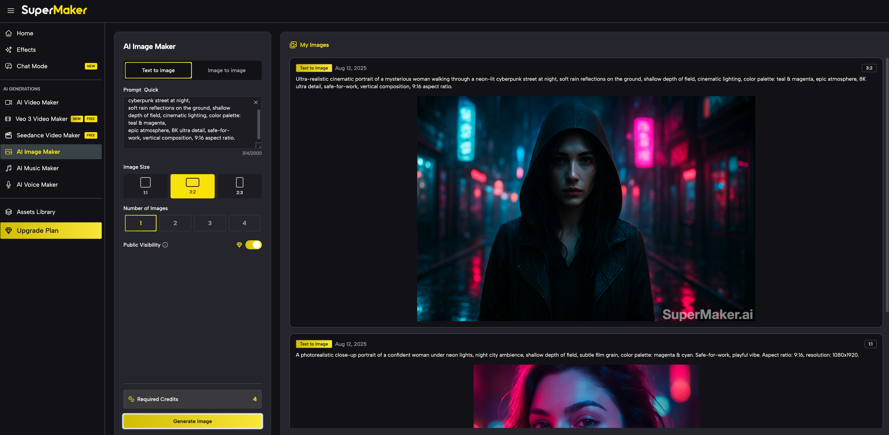
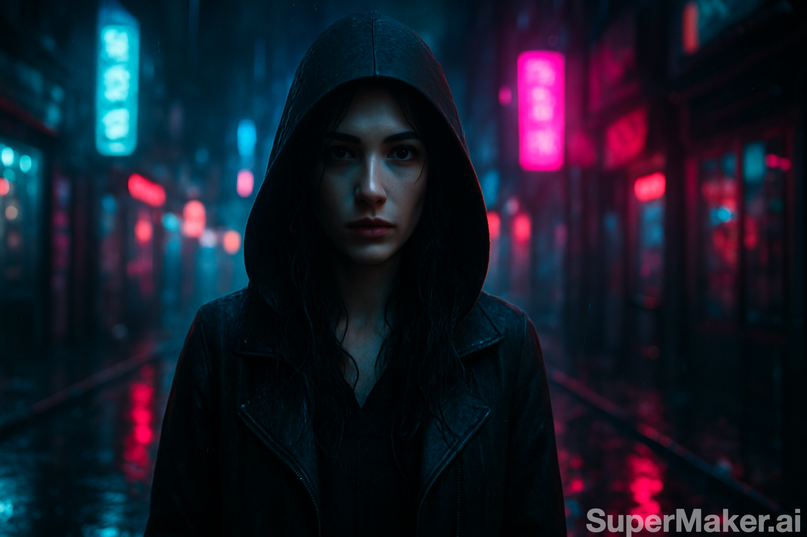

# SuperMaker AI — Next-Generation Visual Storytelling Assistant

**SuperMaker AI** is an all-in-one creative assistant that transforms your ideas into stunning **images, videos, voiceovers, and music**—all in one place. Whether you’re a content creator, social media influencer, or marketing professional, SuperMaker AI helps you complete the entire workflow from **concept → assets → final product** in just minutes.

---

## 🚀 One-Line Pitch

For creators who want to quickly craft scroll-stopping content, SuperMaker AI turns your prompts into ready-to-publish media—**no editing skills required**.

---

## 🎯 Who It's For

* **Social Media Creators**: Daily content for TikTok, Instagram, YouTube Shorts
* **Marketing Teams & Agencies**: Ads, brand visuals, product videos
* **Independent Creators & Side Hustlers**: Build personal brands and digital marketing campaigns
* **Entertainment Producers**: Cutting-edge, viral short-form videos
* **Educators & Trainers**: Visual explainers, online course videos, event promos

---

## 💡 Key Features & Core Capabilities

SuperMaker AI Chat is more than just a chatbot—it’s your creative co-producer, capable of understanding complex requests, planning execution, and delivering multiple types of media in one seamless process.

### Solving Traditional Pain Points

* **No More Overcomplicated Forms**: Just describe your creative goal in natural language to start
* **Break Down Content Silos**: Create videos, images, music, and voiceovers all in one conversation
* **Context-Aware Consistency**: Reuse your existing assets to maintain style and brand alignment

### Highlights

* **Conversational AI Assistant**: Turn ideas into production plans and finished assets
* **Multi-Modal Creation**: Generate images, videos, voiceovers, and music in one workflow
* **Template Library**: Instantly reuse and adapt trending formats
* **One-Click Publishing**: Portrait & landscape formats for all major social platforms
* **Smart Task Breakdown & Parallel Processing**: Compress hours of work into minutes

---

## 🔍 Tech Architecture & Model Support

### Core Architecture

Three core components power SuperMaker AI:

1. **FlowController** – The “brain” that parses natural language, understands intent, and manages the creative flow
2. **TaskScheduler** – Manages multi-task concurrency with fault recovery for efficiency and stability
3. **GenerationHandler** – Dynamically selects and combines the most suitable generation engines for each creative step

### Model Support

SuperMaker AI automatically selects and combines the best engines for your needs, ensuring optimal **visual quality, smooth motion, and emotional consistency**:

* **Images**: Ultra clarity + style stability
* **Video**: High frame rate + scene continuity
* **Audio**: Natural voice + emotional delivery
* **AI Assistant**: Multi-model collaboration for coherent and context-aware creation

---

## 📌 Example Use Cases

### **Scenario 1 — Step-by-Step Cinematic Short Film**

**Goal**: Produce a high-quality vertical cinematic short with unified visuals and sound

1. **Image Generation**
   Prompt: *Hyper-realistic cinematic portrait, mysterious woman walking in neon cyberpunk street, rain reflections, shallow depth of field, teal + magenta color grading, 8K detail, 9:16 portrait.*
   
     Prompt Input Screen：
    
   
    Generated Output ：
    

3. **Video Generation**
   Prompt: *Turn the image into a 5-second video, slight camera push-in, rain animation, lens flare, keep color grading, 1080x1920 resolution.*
   
  Prompt Input Screen：  
    

  Generated Output (MP4)：  
  [▶ Watch Video](./screenshots/video.mp4)

4. **Voiceover & Music**
   Voice Prompt: *Soft mysterious female voice: “In the city of neon dreams, every step tells a story…”*
   Audio Prompt: *Cinematic ambient music, slow tempo, deep bass, cyberpunk night vibe, 15 seconds.*
   🎧 [Listen to Audio](https://example.com/audio1)

5. **Final Assembly**
   🎥 [Watch Final MP4](https://example.com/final1)

---

### **Scenario 2 — AI Assistant-Driven Video**

**Goal**: Use AI Chat to fully automate a 20-second inspirational vertical video for entrepreneurs

User Input: *Make a 20-second vertical inspirational short video for entrepreneurs, featuring cinematic scenes, motivational voiceover, and passionate background music.*

Assistant Workflow:

1. **Intent Recognition**: Lock onto “motivation + entrepreneurship” theme
2. **Task Breakdown**: Script → Scene Images → Video Assembly → Audio → Final Edit
3. **Model Collaboration**: Auto-select optimal models to ensure style consistency
4. **Output**:
   🎥 [Watch Final Video](https://example.com/final2)

---

### **Scenario 3 — Template-Based “Same Style” Creation**

**Goal**: Quickly replicate a trending style for a new product or theme

1. **Select Template**: Choose “Fashion Vertical Video”
2. **Replace Assets**
   Prompt: *Replace the main model with a smiling woman in a red dress walking on a Paris street, Eiffel Tower in the background, cinematic bokeh.*
3. **Output**: Auto-match music, transitions, captions to keep the same pacing & style
   🎥 [Watch Template Output](https://example.com/final3)

---

## 🌟 What Makes Us Different

1. **Beyond Keyword Matching** – Deep intent understanding
2. **Parallel Processing Engine** – Far faster than sequential generation
3. **Unified Multi-Modal Workflow** – No app-switching required
4. **Context-Aware Creation** – Maintain style & brand continuity

---

## 🚀 Vision: AI Agent Collaboration Network

Our starting point is a powerful AI Chat, but our ultimate goal is an **AI Multimedia Agent Network**:

* **Director AI**: Narrative & camera design
* **Artist AI**: Concept art, characters, and environments
* **Composer AI**: Music & sound effects
* **Editor AI**: Assemble all assets into the final film

---

## 📌 Why Choose SuperMaker AI?

* **Not Just a Video Agent**: A full-spectrum multimedia creative hub
* **Made for Professionals & Teams**: Video producers, marketers, designers, podcasters
* **Always-On**: Create anytime, anywhere

---

## 📬 Get Started

1. Sign up at [supermaker.ai](https://supermaker.ai)
2. Try Chat Mode or start from a Template
3. Create, preview, and export your final product

> **SuperMaker AI — Turn ideas into content instantly**

