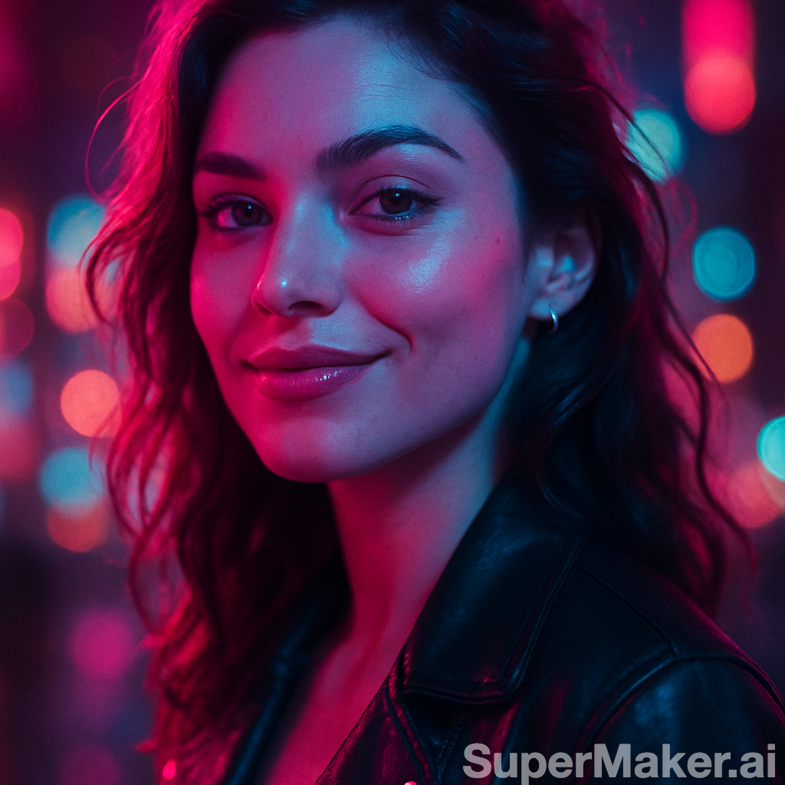
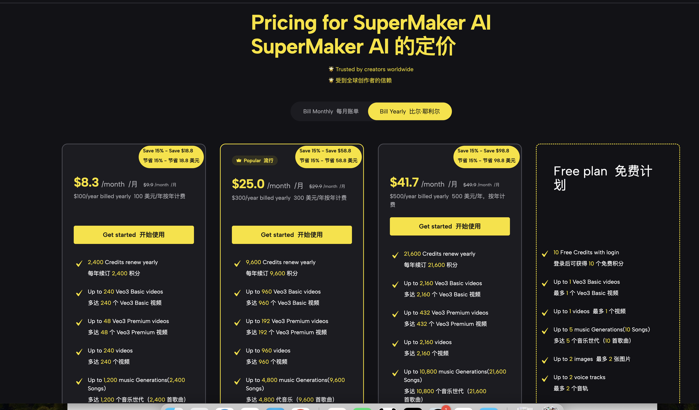

# Supermaker AI

**Supermaker AI** 是面向全球内容创作者的 **多模态 AI 创作平台**。  
由 **Chat 模式（内容创作 Agent）** 驱动，从一句话想法，自动完成 **脚本 → 图片/视频 → 配音 → 音乐 → 合成** 的成片流程。  
目标用户：TikTok / Reels / Shorts 创作者、娱乐向短视频账号、风格多样化的二创博主（合规范围内）。

---

## ✨ 为什么选择 Supermaker AI？

### 1) Chat 模式 = 内容创作 Agent（核心亮点）
不是“聊天窗口”，而是你的 **虚拟创意总监 + 执行团队**：

- **意图识别**：理解你的自然语言目标（如“做个 15s 竖屏 neon 风视频，带女声配音和轻快 EDM”）
- **任务拆解**：自动拆分为可执行步骤（脚本/画面/配音/音乐/合成）
- **智能调度**：为每步选择合适模型并确定执行顺序（质量/速度兼顾）
- **计划卡 & 批处理**：以 **计划卡** 呈现“Overall Intent Analysis / Style & Consistency / Generation Confirmation / Select Generation Tasks / Batch Collection”
- **记忆与复用**：记住你的偏好与近期项目，越用越懂你

> 你只需给一个想法，**Agent** 负责把事办了。

### 2) 一站式多模态工作台
- **视频**：Veo 3（电影感）｜Seedance 1.0 Lite（快速产出）
- **图片**：Text→Image / Image→Image（含尺寸/风格/批量）
- **配音**：多音色 TTS（如 “Marie” 等）
- **音乐**：Music Maker v4（Genre/Moods/Tempo/Lyrics 全参数）
- **特效/模板**：一键风格化、模板同款生成
- **资源库**：All / Image / Video / Music / Voice 分类管理，含 Active / Processing / Completed 状态

---

## 🧠 模型支持（按功能）

| 功能 | 模型/版本（以 UI 为准） |
|---|---|
| **Chat（Agent）** | LLM + Orchestration（意图识别 → 任务拆解 → 调度 → 记忆） |
| **Video** | **Veo 3 Video Maker**（高质）、**AI Video Maker：Seedance 1.0 Lite**（快速） |
| **Image** | 默认 Text-to-Image / Image-to-Image（页面尺寸/风格/批量） |
| **Voice** | 多音色 TTS（示例：Marie 等） |
| **Music** | **AI Music Maker v4**（Genre / Moods / Voices / Tempos / Lyrics） |
| **Effects / Templates** | 实时特效 & 模板同款（导入素材→一键风格化/套模板） |

> 说明：以上名称与版本均以你提供的界面为准；如需补全具体模型名，请在上线前将本表更新为最终文案。

---

## 🏆 产品优势与亮点

1. **从想法到成品的一键闭环**：Agent 自动完成脚本、画面、配音、音乐与合成。  
2. **双轨视频生成（质量/速度可选）**：Veo 3 追求电影感，Seedance 1.0 Lite 用于快速量产。  
3. **多模态协同**：视频、图片、配音、音乐同台完成，风格一致性更强。  
4. **批量与风格多样化**：一次创建多个任务卡，做 A/B 测试与风格对比。  
5. **模板同款生成**：选一个模板，替换素材与台词，即刻做出“同风格”的爆款高仿。  
6. **资源追溯与复用**：生成物统一入库，支持分类筛选、下载与二次创作。  
7. **信用点计费（Credits）透明**：不同任务对应不同消耗，便于预算管理与算力控制。  
8. **短视频优先**：默认对 9:16 竖屏、10–15s 爆款节奏做优化；特效与封面链路顺畅。

---

## 🎬 三个上手案例（含可直接复用的提示词）

> 你将按下述步骤实操生成素材，并把文件放入 `./screenshots/`；README 会直接展示。  
> 所有 Prompt **英文**编写，**合规但有张力**（Safe-for-work, spicy vibes）。

### 案例一｜**分步骤到成片**：图 → 视频 → 配音 → 音乐 → 合成  
**适合**：需求明确、希望完全操控每一步的用户  
**目标**：做一个 12–15s 的竖屏娱乐向短视频

**Step 1：Image（生成 1–3 张视觉主图）**  
> 页面：Image → Text-to-Image（或 Image-to-Image）  
**Prompt：**
A photorealistic close-up portrait of a confident woman under neon lights,
night city ambience, shallow depth of field, subtle film grain,
color palette: magenta & cyan. Safe-for-work, playful vibe.
Aspect ratio: 9:16, resolution: 1080x1920.
> 

**Step 2：Video（I2V/或 T2V）**  
> 页面：Video → 选择 Veo 3（高质）或 Seedance 1.0 Lite（快速）  
**I2V Prompt（基于 Step 1 图片）**：
Animate the provided image into a 12-second vertical video.
Motion: subtle head tilt, glance to camera, playful half-smile.
Style: neon cinematic, light rain reflection, soft camera shake.
Hook in first 2 seconds; clean title card at 10s.

markdown
复制
编辑

**Step 3：Voice（TTS 配音）**  
> 页面：Voice → 选音色（如 Marie），输入台词  
**Script（≤ 2 句）**：
"Miss me already?"
"Follow for part two."
Tone: warm, playful; pacing: 0.95x; language: English.

markdown
复制
编辑

**Step 4：Music（v4 生成 BGM）**  
> 页面：Music Maker v4  
**Prompt：**
Genre: EDM / Future Bass
Mood: playful, confident
Tempo: 110 BPM
Structure: 12–15s loop-friendly
Notes: keep it clean for social platforms.

markdown
复制
编辑

**Step 5：合成导出**  
> 页面：合成/导出（将视频 + 配音 + BGM 合成）  
结果：`final-clip-case1.mp4`（无水印/适配 9:16）

**建议截图位**：  
`./screenshots/img-gen.png`、`./screenshots/video-i2v.png`、`./screenshots/tts.png`、`./screenshots/music.png`、`./screenshots/composer.png`、`./screenshots/final-case1.png`

---

### 案例二｜**创意视频（Chat Agent 驱动）**：一键从想法到成片  
**适合**：不想管参数，只想“说需求 → 出片”的用户  
**目标**：让 Agent 全自动执行“脚本→视频→配音→音乐→合成”

**Chat 输入（你在 Chat 模式粘贴以下 Prompt）**：
You are my creative production agent.
Goal: Make a 15-second vertical TikTok video with a flirty, neon-cinematic vibe.
Deliverables: final video with voiceover (female) and light EDM music.
Constraints: safe-for-work; strong hook in first 2 seconds; 1080x1920; 25–30 FPS.
Process:

Generate a short script (2 lines on-screen + VO).

Pick the best visual style and describe it in 1 sentence.

Create a task plan with steps: T2V/I2V -> TTS -> Music -> Compose.

Execute the plan automatically.

Return download links and a quick “what to improve” note.

markdown
复制
编辑

**Chat Agent 在页面中的表现（对照你的截图）**  
- **Overall Intent Analysis**：解析“15s、竖屏、neon、flirty、VO+BGM”等要点  
- **Style & Consistency**：给出风格说明与一致性原则（色调/镜头语言/字幕位置）  
- **Generation Confirmation**：展示步骤与参数草案  
- **Select Generation Tasks**：生成 2–3 个风格候选任务卡（可多选批量）  
- **Batch Collection**：批量执行 & 进度可视（Active / Processing / Completed）

**最终输出**：`final-clip-case2.mp4`（以及 Agent 的改进建议）  

**建议截图位**：  
`./screenshots/chat-intent.png`、`./screenshots/chat-plan.png`、`./screenshots/chat-tasks.png`、`./screenshots/chat-progress.png`、`./screenshots/chat-final.png`

---

### 案例三｜**模板同款生成**：一键套模板，快速做“同风格作品”  
**适合**：要追热点、要稳定复制“某种风格/结构”的用户  
**目标**：基于模板快速做 10s 同款短视频

**Step 1：选择模板**  
> 页面：Templates（或 Video Maker 内的模板入口 / Effects 模板页）  
示例：`Neon Tease 10s` / `Retro VHS 10s` / `Cinematic Tease 12s`

**Step 2：替换元素**  
- **封面图**：上传你的 `img-hero.png`  
- **台词**：替换模板里的两行字幕  
- **配音**：选择音色 + 粘贴文本  
- **音乐**：保留模板自带或用 v4 重生成（相同时长/节奏）

**Step 3：生成与导出**  
- 一键生成同款，得到 `final-clip-case3.mp4`  
- 如需 A/B 测试，复制此模板修改 1–2 个参数重新出片

**可选 Prompt（用于模板的自定义字段）**：
Style note: neon cinematic, playful, safe-for-work; strong glow edges;
title font: clean sans-serif; film grain: subtle; cuts: 4–6.

yaml
复制
编辑

**建议截图位**：  
`./screenshots/template-list.png`、`./screenshots/template-editor.png`、`./screenshots/template-final.png`

> 亮点补充到其他模块：  
> - 在 **视频/图片/配音/音乐** 功能说明中标注“支持基于模板快速生成同款”，  
> - 在 **优势** 中加入“模板化量产能力 + A/B 快速实验”。

---

## 🧭 快速开始（带截图位）

1. **打开 Chat 模式** → 输入你的创意或粘贴上述案例 Prompt  
   

2. **查看计划卡**（意图分析 / 风格 / 任务确认 / 任务卡）  
   

3. **执行任务（批量可选）→ 进度追踪**  
   

4. **下载成品或继续二次创作（特效/模板/配音替换）**  
   

---

## 💳 价格与计费（Credits）

- 按任务类型消耗信用点，清晰可控  
- 付费档支持 **无水印下载**  
- 具体档位以官网定价页为准  

---

## ✅ 小贴士（安全与平台友好）

- 支持“合规但有张力”的娱乐/挑逗风格：**Safe-for-Work**，避免露骨表达  
- 建议用 **风格/氛围/光影/镜头** 来增强吸引力，而非敏感元素  
- 封面与时长建议：**9:16，10–15s，前 2s 强钩子**，字幕行不宜过多

---

## ▶️ 开始创作
👉 访问官网并登录：**https://supermaker.ai/**  
👉 打开 **Chat 模式**，用以上三个案例的 Prompt 直接试一遍。

---
