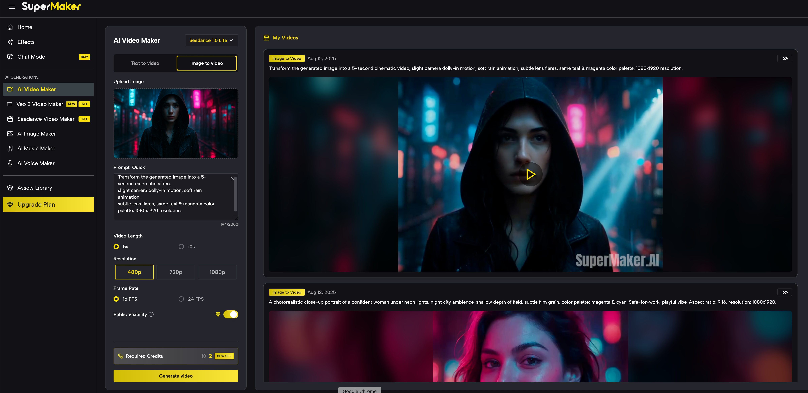
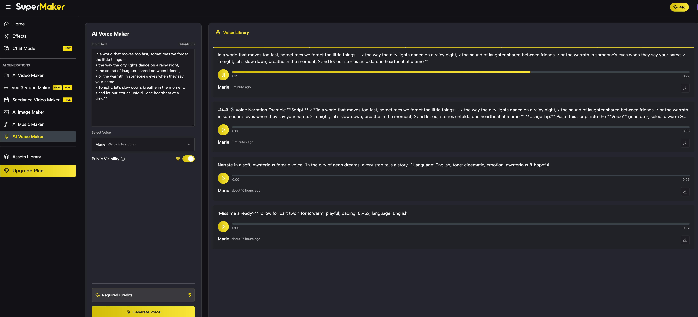
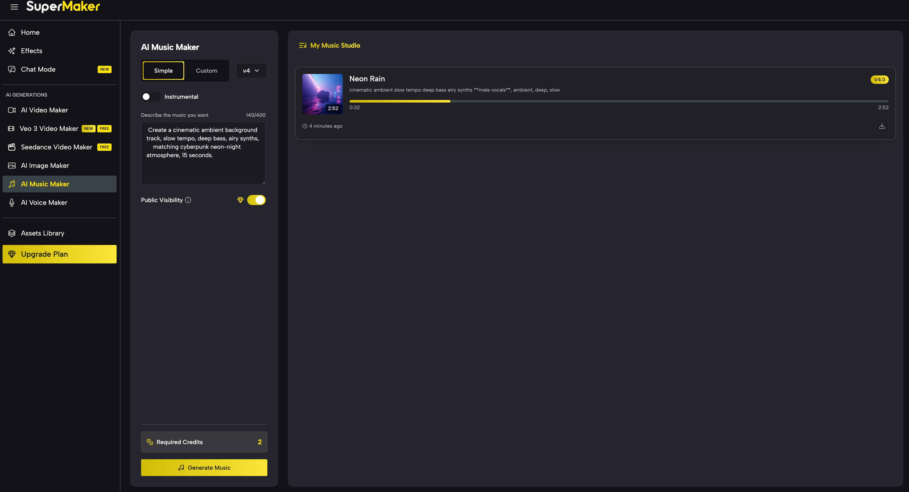
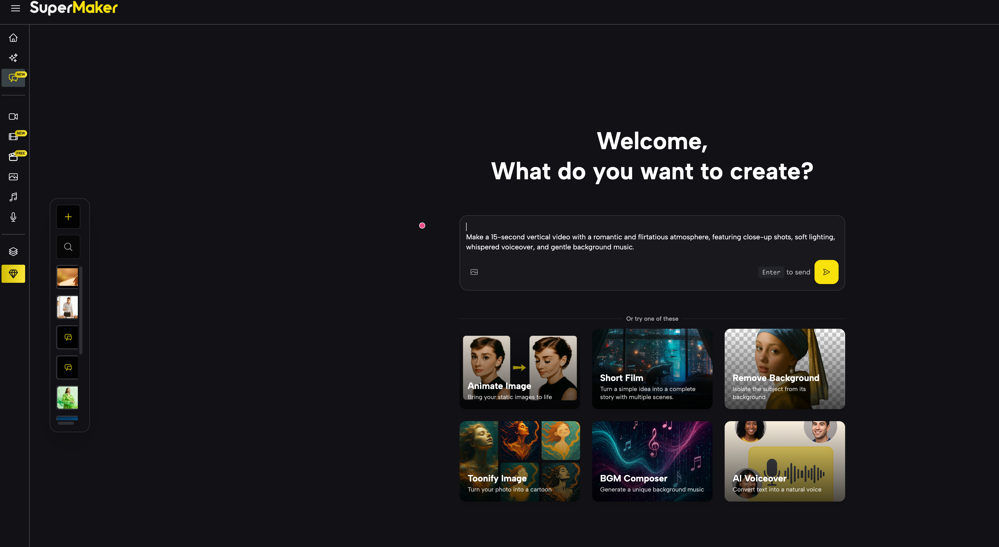
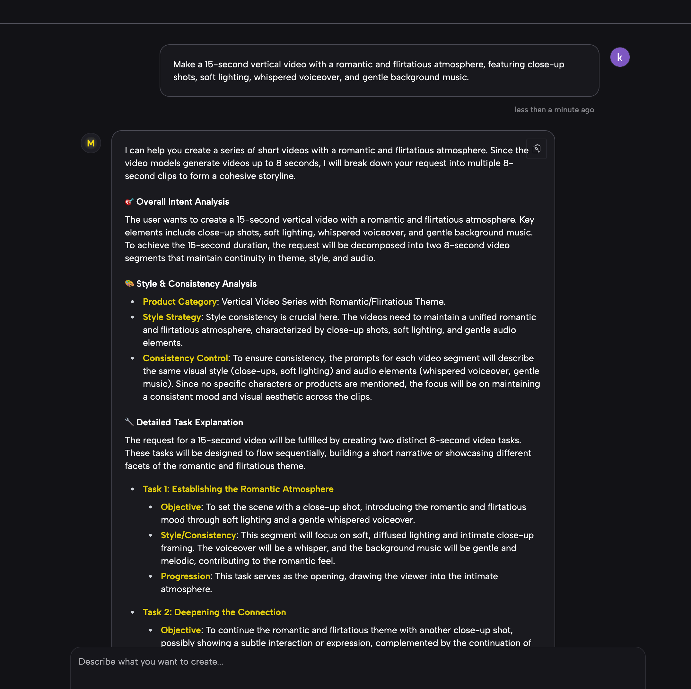
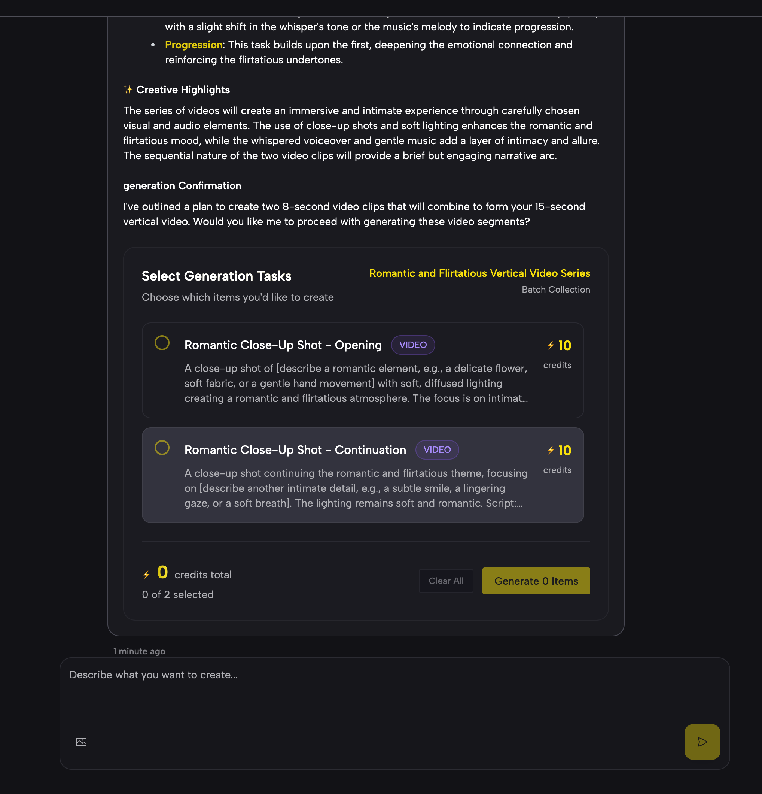
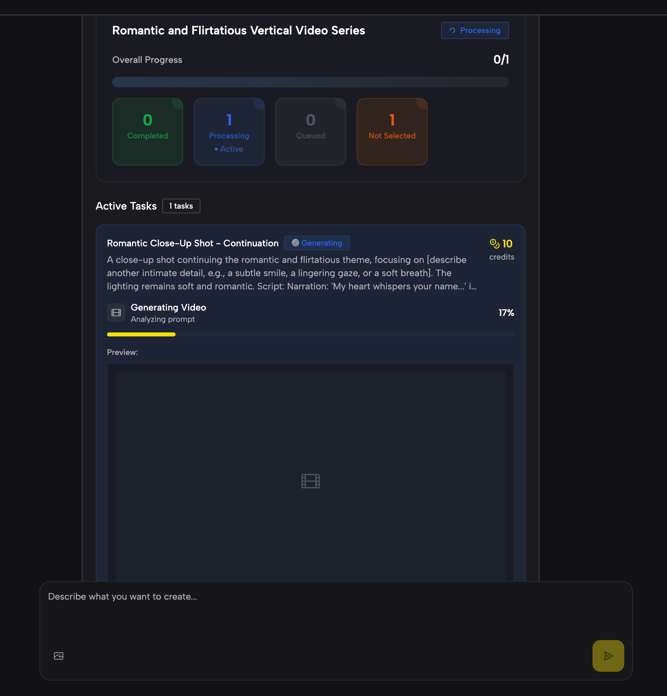
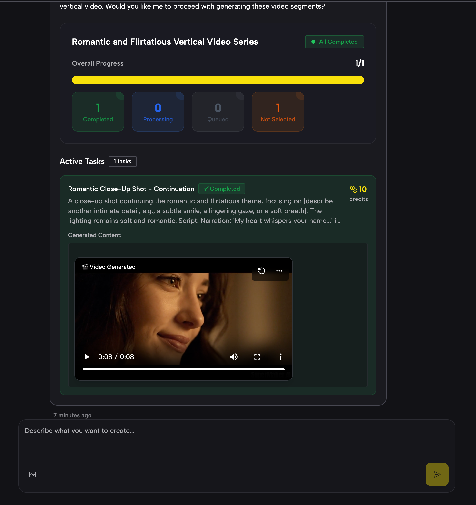
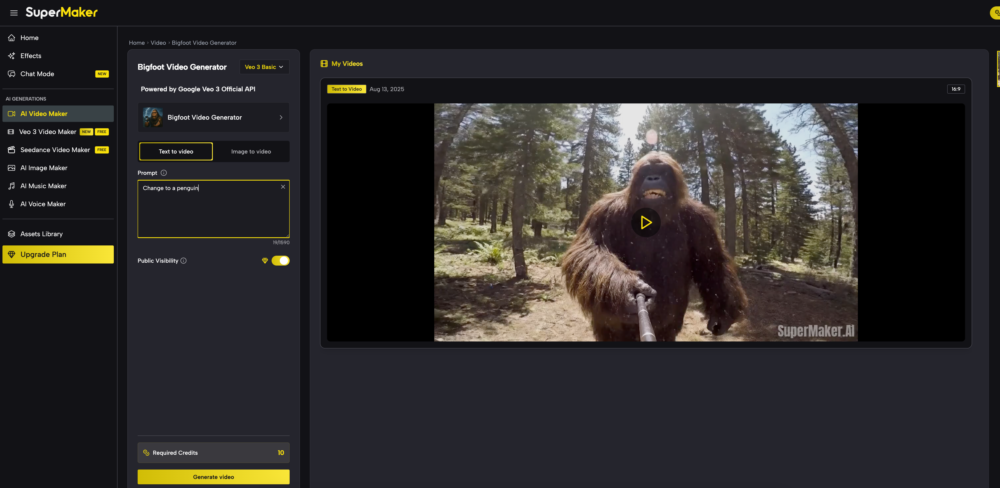

# SuperMaker AI — Next-Generation Visual Storytelling Assistant

**SuperMaker AI** is an all-in-one creative assistant that transforms your ideas into stunning **images, videos, voiceovers, and music**—all in one place. Whether you’re a content creator, social media influencer, or marketing professional, SuperMaker AI helps you complete the entire workflow from **concept → assets → final product** in just minutes.

---

## 🚀 One-Line Pitch

For creators who want to quickly craft scroll-stopping content, SuperMaker AI turns your prompts into ready-to-publish media—**no editing skills required**.

---

## 🎯 Who It's For

* **Social Media Creators**: Daily content for TikTok, Instagram, YouTube Shorts
* **Marketing Teams & Agencies**: Ads, brand visuals, product videos
* **Independent Creators & Side Hustlers**: Build personal brands and digital marketing campaigns
* **Entertainment Producers**: Cutting-edge, viral short-form videos
* **Educators & Trainers**: Visual explainers, online course videos, event promos

---

## 💡 Key Features & Core Capabilities

SuperMaker AI Chat is more than just a chatbot—it’s your creative co-producer, capable of understanding complex requests, planning execution, and delivering multiple types of media in one seamless process.

### Solving Traditional Pain Points

* **No More Overcomplicated Forms**: Just describe your creative goal in natural language to start
* **Break Down Content Silos**: Create videos, images, music, and voiceovers all in one conversation
* **Context-Aware Consistency**: Reuse your existing assets to maintain style and brand alignment

### Highlights

* **Conversational AI Assistant**: Turn ideas into production plans and finished assets
* **Multi-Modal Creation**: Generate images, videos, voiceovers, and music in one workflow
* **Template Library**: Instantly reuse and adapt trending formats
* **One-Click Publishing**: Portrait & landscape formats for all major social platforms
* **Smart Task Breakdown & Parallel Processing**: Compress hours of work into minutes

---

## 🔍 Tech Architecture & Model Support

### Core Architecture

Three core components power SuperMaker AI:

1. **FlowController** – The “brain” that parses natural language, understands intent, and manages the creative flow
2. **TaskScheduler** – Manages multi-task concurrency with fault recovery for efficiency and stability
3. **GenerationHandler** – Dynamically selects and combines the most suitable generation engines for each creative step

### Model Support

SuperMaker AI automatically selects and combines the best engines for your needs, ensuring optimal **visual quality, smooth motion, and emotional consistency**:

* **Images**: Ultra clarity + style stability
* **Video**: High frame rate + scene continuity
* **Audio**: Natural voice + emotional delivery
* **AI Assistant**: Multi-model collaboration for coherent and context-aware creation

---

## 📌 Example Use Cases

### **Scenario 1 — Step-by-Step Cinematic Short Film**

**Goal**: Produce a high-quality vertical cinematic short with unified visuals and sound

1. **Image Generation**
   
   Prompt:

    *Hyper-realistic cinematic portrait, mysterious woman walking in neon cyberpunk street, rain reflections, shallow depth of field, teal + magenta color grading, 8K detail, 9:16 portrait.*
   
     Prompt Input Screen：
   
    
   
    Generated Output ：
   
    
   

2. **Video Generation**
   
   Prompt:

    *Turn the image into a 5-second video, slight camera push-in, rain animation, lens flare, keep color grading, 1080x1920 resolution.*
   
   Prompt Input Screen：  
  
      
  
   Generated Output (MP4)：

    https://github.com/user-attachments/assets/2b9d264d-532e-4499-a582-f2f85664fafa

  
3. **Voiceover & Music**
   
   Voice Prompt:

    *In a world that moves too fast, sometimes we forget the little things   the way the city lights dance on a rainy night,
    the sound of laughter shared between friends,   or the warmth in someone's eyes when they say your name.
    Tonight, let's slow down, breathe in the moment,   and let our stories unfold… one heartbeat at a time.”*
   
   
   

   download Voice：
   
   https://raw.githubusercontent.com/SuperMakerAI/AI-Video-Maker/main/screenshots/voice.mp4
   
   
   music Prompt:

   *cinematic ambient slow tempo deep bass airy synths male vocals ambient deep slow*

   
   

   download Music：
   
   https://raw.githubusercontent.com/SuperMakerAI/AI-Video-Maker/main/screenshots/music.wav

---

### **Scenario 2 — AI Assistant-Driven Video**

**Goal**: Use AI Chat to fully automate a 15-second vertical video with a romantic and flirtatious atmosphere  

User Input: 

*Make a 15-second vertical video with a romantic and flirtatious atmosphere, featuring close-up shots, soft lighting, whispered voiceover, and gentle background music.*

Assistant Workflow:

  
  

1. **Intent Recognition**: Lock onto the “romantic + flirtatious” theme
   
     
   

   
2. **Task Breakdown**: Script → Scene Images → Video Assembly → Audio → Final Edit
   
    
   
     

     
   
3. **Model Collaboration**: Auto-select optimal models to ensure consistency in mood, lighting, and pacing

     
   
4. **Output**:
   
   https://github.com/user-attachments/assets/f5cdcf44-e241-44f4-8621-99b2bf5265ce

---

### **Scenario 3 — Template-Based “Same Style” Creation**

**Goal**: Quickly replicate a trending style for a new product or theme

1. **Select Template**: Choose “Fashion Vertical Video”
2. **Replace Assets**
   Prompt: *Replace the main model with a smiling woman in a red dress walking on a Paris street, Eiffel Tower in the background, cinematic bokeh.*
3. **Output**: Auto-match music, transitions, captions to keep the same pacing & style
   
     Prompt Input Screen：
    
   
    Generated Output ：
     
   https://github.com/user-attachments/assets/a373e217-eff7-4adf-9246-0fe7bcd4d282

---

## 🌟 What Makes Us Different

1. **Beyond Keyword Matching** – Deep intent understanding
2. **Parallel Processing Engine** – Far faster than sequential generation
3. **Unified Multi-Modal Workflow** – No app-switching required
4. **Context-Aware Creation** – Maintain style & brand continuity

---

## 🚀 Vision: AI Agent Collaboration Network

Our starting point is a powerful AI Chat, but our ultimate goal is an **AI Multimedia Agent Network**:

* **Director AI**: Narrative & camera design
* **Artist AI**: Concept art, characters, and environments
* **Composer AI**: Music & sound effects
* **Editor AI**: Assemble all assets into the final film

---

## 📌 Why Choose SuperMaker AI?

* **Not Just a Video Agent**: A full-spectrum multimedia creative hub
* **Made for Professionals & Teams**: Video producers, marketers, designers, podcasters
* **Always-On**: Create anytime, anywhere

---

## 📬 Get Started

1. Sign up at [supermaker.ai](https://supermaker.ai)
2. Try Chat Mode or start from a Template
3. Create, preview, and export your final product

> **SuperMaker AI — Turn ideas into content instantly**
